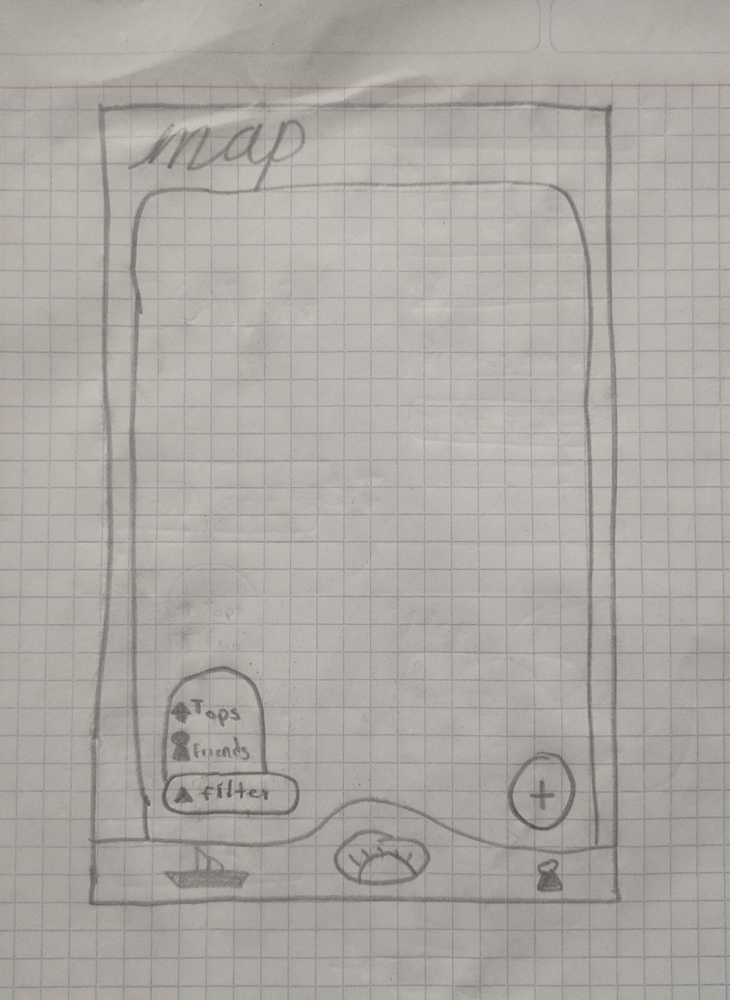
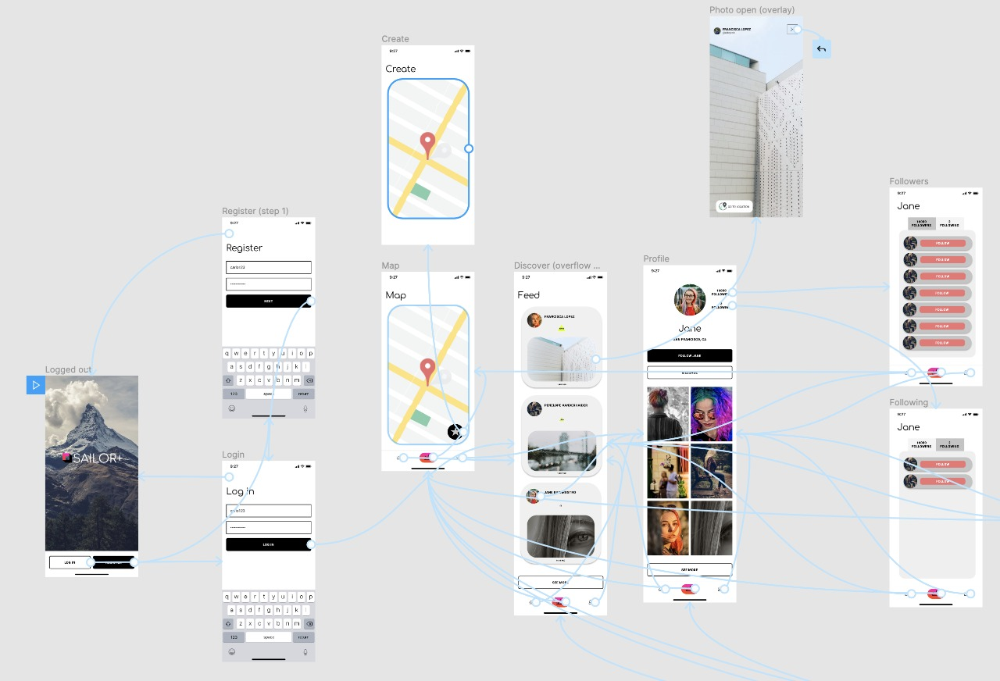

# Sailor +

## Table of Contents
1. [Overview](#Overview)
2. [Product Spec](#Product-Spec)
3. [Wireframes](#Wireframes)
4. [Schema](#Schema)

## Overview
### Description
Sailor+ is an app created to find and share the best places to travel around the world, follow your friends and start exploring locations, attractions, nature, and more!!. No matter where you are at or if you're just sitting in your house because you can find new places on a simple click.

### App Evaluation
- **Category:** Traveling/Lifestyle adventure
- **Mobile:** The app is suited for mobile use since it gives users easy access to a lot of features in a easy and effective way
- **Story:** Most people loves to travel, but there are limitations every time we want to, for example: money, time, and the most important part, you don't know where to go – with Sailor+ you can view a map full of locations, visit places virtually before you visit them in person, view pictures of people around the world, follow people, give "tops"(a like alternative) to the places and photos you like the most and start uploading your own places!.
- **Market:** Influencers, people that travel & like to take photos, people that love scenery photography, People with free time, etc.
- **Habit:** The users would open this app every day to check the people they follow, or to explore a zone, see the most popular places and photos before they start traveling, or just for fun and to kill time.
- **Scope:** The application would have a good amount of active users that continue uploading photos of the places they travel and start making a community, also the possibility to find travel agencies, promos and the best prices when searching for places.

## Product Spec

Must have app requirements

- [X] Your app has multiple views
- [X] Your app interacts with a database (e.g. Parse)
- [X] You can log in/log out of your app as a user
- [X] You can sign up with a new user profile
- [X] Your app integrates with at least one SDK (e.g. Google Maps SDK, Facebook SDK) or API (that you didn’t learn about in CodePath)
- [X] Your app uses at least one gesture (e.g. double tap to like, e.g. pinch to scale)
- [X] Your app uses at least one animation (e.g. fade in/out, e.g. animating a view growing and shrinking)
- [X] Your app incorporates at least one external library to add visual polish
- [X] Your app provides opportunities for you to overcome difficult/ambiguous technical problems.

### 1. User Stories (Required and Optional)

**Required Must-have Stories**
  * **WEEK 1**
    * **Visuals**
    - [X] User uses fragments to move screen to screen
    * **Log in**
    - [X] User can sign in/sign up to an account using Parse
    - [X] User is persisted
    * **Map**
    - [X] User can see a map with pins of the top 20 places
      - [X] User can use see a Google map
      - [X] The map execute a query to load most popular locations
    - [X] User can see a list of the top user photos of a selected place inside a modal/new activity
    - [X] User can add a photo of his travel location, and a caption
    * **Profile**
    - [X] User can click on a button in his profile page to see the settings of his account
      * **Settings screen**
      - [X] User can log out
    - [X] User can change his profile picture

    ### FIRST SPRINT

   

* **WEEK 2**
    * Map
     - [X] User can filter by friends locations
       - [X] The app executes a query that shows the most popular locations of the places your friends have visited
     - [X] User can click on the location of the selected post to see a modal/activity of the top posts of that location
     - [X] User can double click an image to top a location/post
    * Profile (Personal and specific clicked account)
    - [X] User can see that account location posts in a grid layout
       - [X] The posts will be displayed from newer to oldest
    - [X] User can click on a location post and see details
    - [X] User can see an animation when a specific post is selected to show details
    - [X] User can see the followers of that account
    - [X] User can see the people that account follows

  

 * **WEEK 3**
     * App
     - [X] At least one notification
     * Map
     - [X] User can filter by distance radius
       - [X] The app executes a query that shows the places at a certain distance radius starting at your postition
     - [X] User can filter by location type
       - [X] The user can see a multiple item view to filter in the map
     * Feed
     - [X] User can see a feed with latest photos and details of the places of the people they follow
     - [X] User can see a feed with the posts your friends gave tops
     * Visuals
     - [X] The app visuals must be approved by my manager

 * **WEEK 4 / WEEK 5**
     * App
     - [X] User can swipe down to refresh (feed screen, pin screen, profile screen)
     - [ ] User can edit posts
     - [ ] User can edit his/her profile data
     - [ ] User can filter by Country
     - [ ] User can filter by State
     * Visuals
     - [X] Update item_feed layout visuals
     - [X] Update pin activity layout visuals
     - [X] Update post_item layout visuals
     - [X] Animations on load + Dialogs
     * Bugs
     - [X] Feed logic bugs
     - [X] Explore bug (Location not working correctly)
     - [X] Following/Follower bugs
     - [X] Filtering posts inside location bug

 **Optional Nice-to-have Stories**
 - [X] * User can see an intelligent recommendation of locations in the feed
 * Extra polished UI design
 * User can filter the locations with parameters like : recommended, number of reviews, country, state
 * User can send direct messages to other users
 * Comment on a post

### 2. Screen Archetypes

* Log up/in Screen
  * User can sign in/sign up to an account using Parse

* Map
  * User can see a map with the top 20 places
  * User can see a list of the top user photos of a selected place inside a modal/new activity
  * User can filter by friends locations
  * User can add a photo of his travel location, and a caption

* Discover screen
  * User can see a feed with latest photos and details of the places of the people they follow
  * User can click on the image to see a detailed view
  * User can click on the location of the selected post to see a modal/activity of the top posts of that location
  * User can scroll down with endless scrolling (or until there are no more photos to show)

* Profile screen
  * User can click on a button to see the settings of his account
    * Settings screen
      * User can log out
  * User can change his profile picture
  * User can see the his followers
  * User can see the people they follow
  * User can scroll down with endless scrolling (or until there are no more photos to show)
  * User can see his location posts in a grid layout
  * User can click on a location post and see details

* Selected profile screen
  * User can see the followers
  * User can see the people that account follows
  * User can scroll down with endless scrolling (or until there are no more photos to show)
  * User can see that account location posts in a grid layout
  * User can click on a location post and see details

### 3. Navigation

**Tab Navigation** (Tab to Screen)

* Map screen
* Feed Screen
* Profile screen
* Detailed post screen
* Selected profile screen
* followers/following screen
* Location posts modal/activity screen

**Flow Navigation** (Screen to Screen)

* Map screen
   * Location posts
   * Create location
   *
* [list second screen here]
   * [list screen navigation here]
   * ...

## Wireframes

### [BONUS] Digital Wireframes & Mockups

### [BONUS] Interactive Prototype

## Schema
### Models
#### User

   | Property      | Type     | Description |
   | ------------- | -------- | ------------|
   | name          | String   | Name of the user |
   | password      | String   | Password of the user |
   | followers     | List<Pointer to user>| Followers of the user |
   | following     | List<Pointer to user> | People followed by the user |
   | profilePicture| File | User profile picture|

#### Post
   | Property      | Type     | Description |
   | ------------- | -------- | ------------|
   | author        | Pointer to User| Post author |
   | image         | File     | image that user posts |
   | caption       | String   | image caption by author |
   | toppedBy      | List     | people that have gave a top to that post |
   | location      | Pointer to location | object location for a post|
   | createdAt     | DateTime | date when post is created (default field) |
   | updatedAt     | DateTime | date when post is last updated (default field) |

 #### Location
   | Property      | Type     | Description |
   | ------------- | -------- | ------------|
   | gmapsid       | String   | Name of the location |
   | locationPosts | List<Pointer to Post>  | List of Posts of that location |
   | createdAt     | DateTime | date when post is created (default field) |
   | updatedAt     | DateTime | date when post is last updated (default field) |

   #### Follows
   | Property      | Type     | Description |
   | ------------- | -------- | ------------|
   | userId        | String   | id of the user |
   | followers     | List<String>  | List of User objectId |
   | following     | List<String>  | List of User objectId |
   | createdat     | DateTime | date when post is created (default field) |
   | updatedAt     | DateTime | date when post is last updated (default field) |

### Networking
#### List of network requests by screen
   - Register screen
      - (Create/POST) Create a new profile picture
      - (Create/POST) Create a new user
   - Home Feed Screen
      - (Read/GET) Query all posts where friends are authors
      - (Read/GET) Query all posts where friends gave tops
      - (Create/POST) Create a new like on a post
      - (Delete) Delete existing like
   - Explore Screen
      - (Read/GET) Query the 20 most liked locations
      - (Read/GET) Query the locations your friends have visited
      - (Read/GET) Query the locations around you at a specified radius
   - Pin Screen
      - (Read/GET) Query all posts inside a location and sort them in descending order
      with the number of tops
      - (Read/GET) Query all posts with specified category
      - (Create/POST) Create a new like on a post
      - (Delete) Delete existing like
   - Create Post/Location Screen
      - (Create/POST) Create a new post and in case the selected location is not in the database create a location and assign that post to that new location
   - Profile Screen
      - (Read/GET) Query all posts of user in descending order
      - (Update/PUT) Update user profile image
      - (Read/GET) Query all posts where user is author
      - (Create/POST) Start following
      - (Delete) Delete following
      - (Read/GET) Get followers
      - (Read/GET) Get Following
 ********************************
